# Identitas Visual & Panduan Brand Kit Dies Natalis ke-44
## SMA Negeri 1 Gedeg, Kabupaten Mojokerto

Selamat datang di repositori resmi **Brand Identity Kit & Rekonstruksi Vektor Master V6 Dies Natalis ke-44 SMA Negeri 1 Gedeg**. 

Repositori ini memuat seluruh berkas master logo vektor matematis, dokumentasi anatomi dan filosofi beranotasi visual, metodologi penarikan garis (*vector tracing*), sistem palet warna resmi Coolors, serta pedoman implementasi *merchandise* resmi (kaos polo, botol minum tumbler, tali lanyard, tas kanvas, dan lencana pin emas).

---

## Daftar Isi
1. [Anatomi & Makna Filosofis Lambang (Visual Breakdown)](#anatomi--makna-filosofis-lambang-visual-breakdown)
2. [Brand Identity Kit & Implementasi Merchandise](#brand-identity-kit--implementasi-merchandise)
3. [Logotype Resmi AVERSA (Tema Dies Natalis ke-44)](#logotype-resmi-aversa-tema-dies-natalis-ke-44)
4. [Metodologi Tracing & Alat Komputasi](#metodologi-tracing--alat-komputasi)
5. [Riwayat Evolusi Perancangan (Sketsa ke V6)](#riwayat-evolusi-perancangan-sketsa-ke-v6)
6. [Sistem Palet Warna Resmi (Coolors Spec)](#sistem-palet-warna-resmi-coolors-spec)
7. [Struktur Repositori & Katalog Aset Master](#struktur-repositori--katalog-aset-master)
8. [Cara Menjalankan Skrip Generator Python](#cara-menjalankan-skrip-generator-python)
9. [Tim Kreatif & Atribusi Karya (Creative Credits)](#tim-kreatif--atribusi-karya-creative-credits--authorship)
10. [Hak Cipta & Lisensi Kepemilikan](#hak-cipta--lisensi-kepemilikan)

---

## Anatomi & Makna Filosofis Lambang (Visual Breakdown)

Lambang Dies Natalis ke-44 SMA Negeri 1 Gedeg dibangun dari perpaduan harmonis antara figur kembar angka 44, siluet kepala rajawali, kobaran api abadi, dan akselerasi sayap aerodinamis.

Berikut adalah diagram diagnostik anatomi lengkap yang memetakan setiap zona lambang:

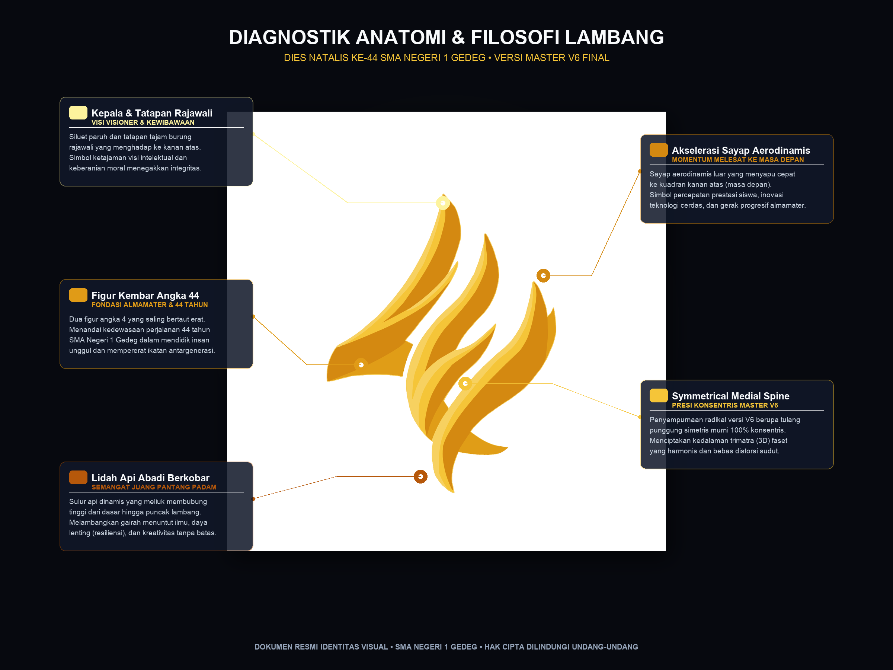

---

### Rincian Bagian & Makna Filosofis Terperinci:

#### 1. Figur Kembar Angka 44 (Zona Inti Lambang)
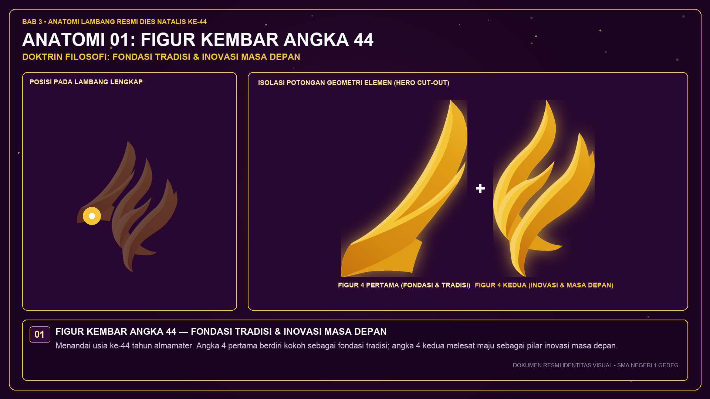

* **Lokasi Anatomi**: Struktur inti yang membentuk kesatuan lambang secara menyeluruh melalui dua figur angka 4 yang saling menopang dan mengunci secara simetris.
* **Makna Filosofis**:
  - **44 Tahun Perjalanan Bersejarah**: Menandai usia ke-44 tahun dedikasi SMA Negeri 1 Gedeg dalam melahirkan putra-putri bangsa yang berprestasi dan berdaya saing tinggi.
  - **Kedewasaan & Stabilitas Institusi**: Angka 4 pertama berdiri kokoh sebagai fondasi tradisi dan sejarah, sedangkan angka 4 kedua melesat maju sebagai pilar inovasi masa depan.
  - **Persatuan Antargenerasi**: Simbol keharmonisan ikatan kekeluargaan antarpendidik, tenaga kependidikan, siswa aktif, dan alumni lintas angkatan.

---

#### 2. Tatapan Burung Rajawali (Zona Puncak Kiri Atas)
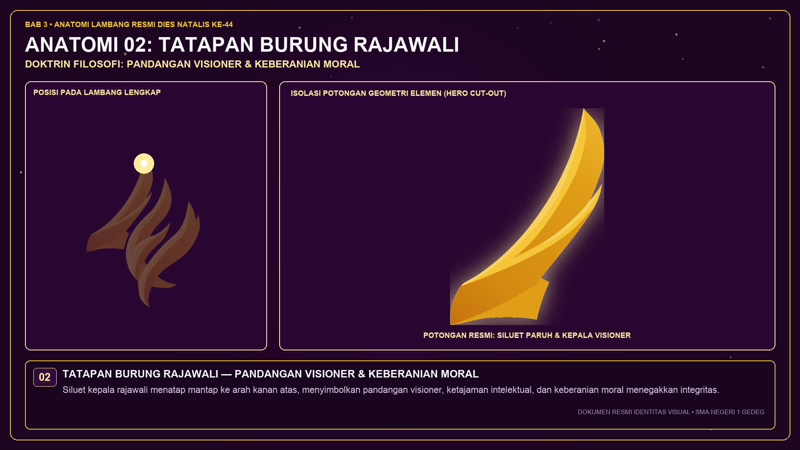

* **Lokasi Anatomi**: Terletak pada puncak figur angka 4 sisi kiri, ditandai siluet paruh melengkung tajam dan mata elang yang mengarah ke kanan atas.
* **Makna Filosofis**:
  - **Ketajaman Intelektual**: Mencerminkan visi keilmuan civitas akademika yang tajam dalam membaca peluang masa depan di era transformasi digital.
  - **Kewibawaan & Ketegasan Moral**: Sikap teguh tanpa kompromi dalam menegakkan integritas, kejujuran akademik, dan tata krama luhur.
  - **Orientasi Masa Depan**: Tatapan yang mengarah ke kuadran kanan atas menyimbolkan keberanian melangkah menyongsong masa keemasan almamater.

---

#### 3. Kobaran Lidah Api Abadi (Zona Dasar & Tubuh Bawah)
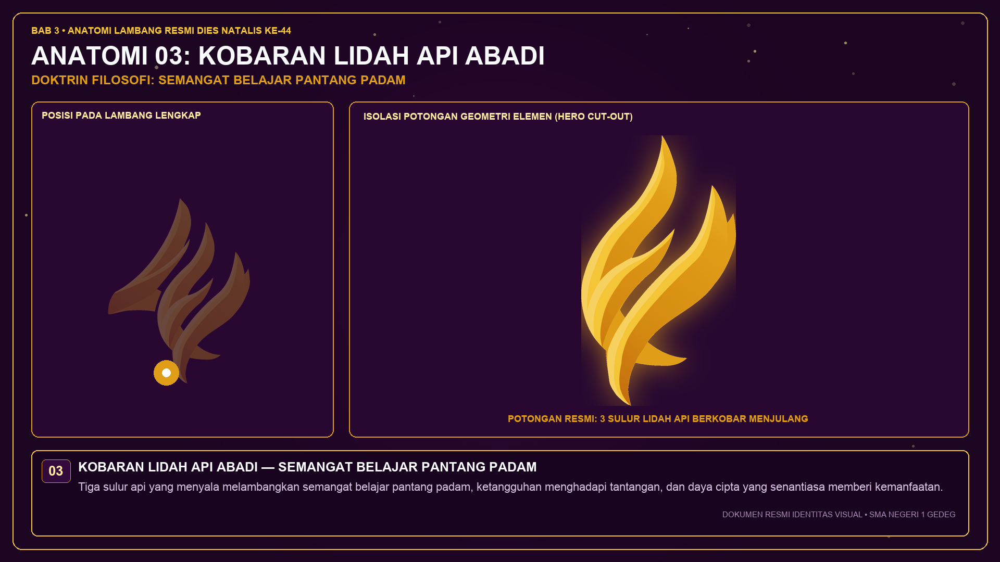

* **Lokasi Anatomi**: Tiga sulur kurva dinamis yang mengalir membubung dari pangkal bawah lambang hingga ke sayap atas dengan gradasi tembaga dan merah marun.
* **Makna Filosofis**:
  - **Semangat Belajar Pantang Padam**: Api menyimbolkan rasa haus akan ilmu pengetahuan dan gairah berkarya yang tak pernah redup di hati warga sekolah.
  - **Resiliensi & Daya Lenting**: Daya tahan tinggi dalam menghadapi berbagai ujian, perubahan kurikulum, serta rintangan zaman tanpa pernah menyerah.
  - **Energi Penerang**: Api kebajikan yang membimbing, menghangatkan, dan memberikan kontribusi nyata bagi masyarakat sekitar.

---

#### 4. Sayap Melesat Aerodinamis (Zona Sayap Kanan Atas)
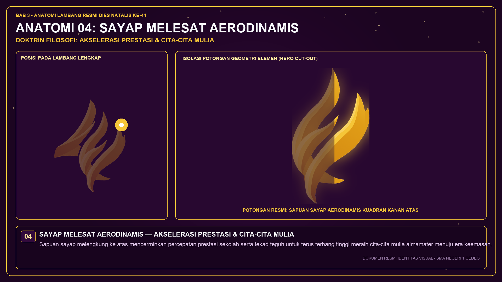

* **Lokasi Anatomi**: Sayap terluar dengan kelengkungan aerodinamis yang menyapu kencang ke sudut kanan atas dengan sudut kemiringan $45^\circ$.
* **Makna Filosofis**:
  - **Akselerasi Prestasi**: Percepatan capaian prestasi akademik, sains, seni, dan olahraga di kancah regional maupun nasional.
  - **Transformasi Berkelanjutan**: Penolakan terhadap stagnasi; institusi senantiasa bergerak dinamis dan adaptif terhadap kemajuan sains dan teknologi global.

---

#### 5. Garis Tengah Simetris (Tulang Punggung Simetris V6)
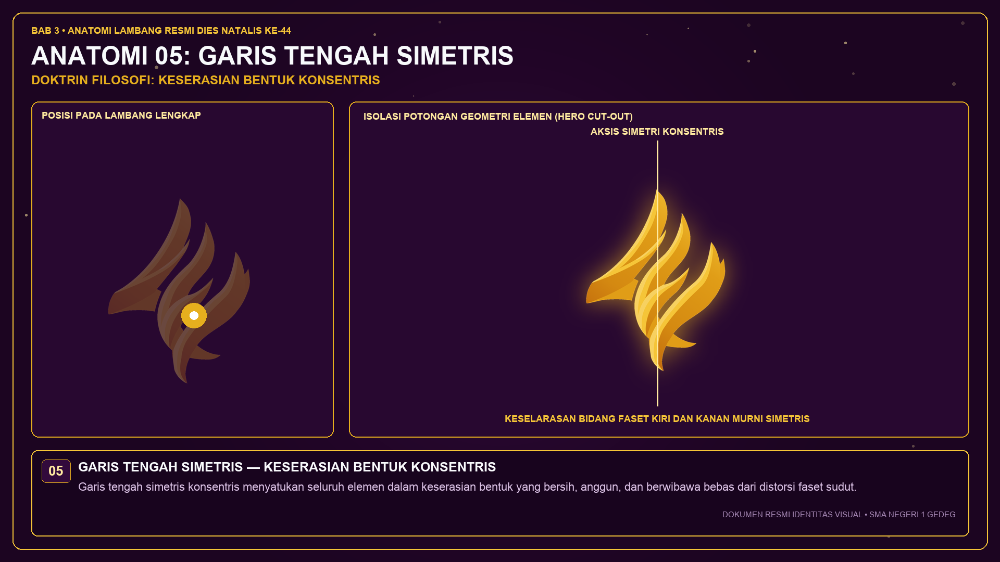

* **Lokasi Anatomi**: Garis pemisah tengah yang membentang di antara figur faset kiri dan kanan, membentuk tulang punggung simetris berbusur konsentris.
* **Keunggulan Geometri V6**:
  - **Simetri 100% Murni**: Memperbaiki lengkungan ekor dan tulang punggung versi terdahulu yang masih kaku, menghasilkan ilusi trimatra (3D) faset yang rapi, bersih, dan bebas cacat sudut.
  - **Keseimbangan Karakter**: Menghubungkan tradisi luhur almamater dengan sayap inovasi modern dalam harmoni rasio keemasan.

---

## Brand Identity Kit & Implementasi Merchandise

Berikut adalah panduan standarisasi penerapan identitas visual pada berbagai atribut dan cendera mata resmi Dies Natalis ke-44 SMA Negeri 1 Gedeg:

### 1. Kaos Berkerah Panitia (Polo Shirt) & T-Shirt Resmi
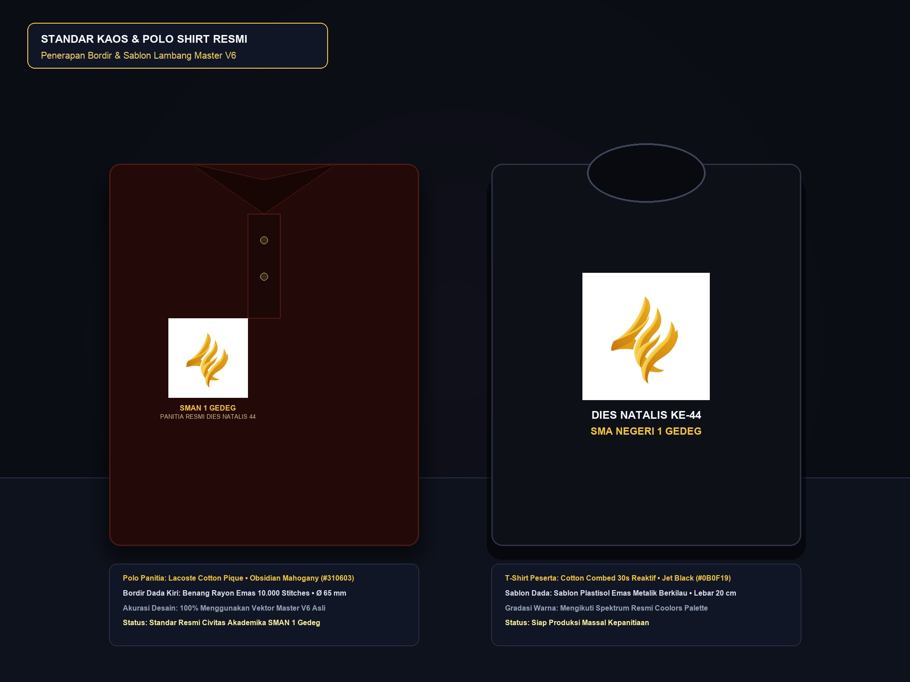

* **Spesifikasi Material**:
  - **Polo Shirt**: Bahan *Lacoste Cotton Pique 24s* lembut, berpori adem, dan menyerap keringat.
  - **T-Shirt Peserta**: Bahan *Cotton Combed 30s Reaktif* hitam pekat (*Jet Black*).
* **Teknik Aplikasi Lambang**:
  - **Dada Kiri**: Bordir komputer presisi (*High-Density Computerized Embroidery*) menggunakan benang rayon emas berkilau (*Metallic Gold Rayon Thread*) dengan ketebalan bordir 10.000 tusukan (*stitches*). Diameter lambang: **65 mm**.
  - **Lengan Kanan**: Teks bordir horizontal "SMA NEGERI 1 GEDEG".
  - **Bagian Belakang (T-Shirt)**: Sablon plastisol emas metalik dengan teks tajuk "DIES NATALIS KE-44 — KEMULIAAN PRESTASI, API INTEGRITAS".
* **Warna Kain Resmi yang Diizinkan**:
  - Hitam Pekat (*Jet Black* / `#0B0F19`) — **Warna Utama Panitia**
  - Merah Marun Gelap (*Obsidian Mahogany* / `#310603`) — **Warna Pengurus Inti**
  - Putih Gading (*Broken White*) — **Warna Civitas Guru**

---

### 2. Botol Minum Termal Stainless Steel (Tumbler)
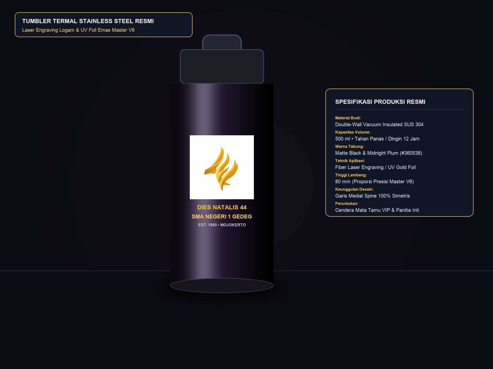

* **Spesifikasi Material**:
  - Tabung *Double-Wall Vacuum Insulated Stainless Steel 304* berkapasitas 500 ml dengan lapisan luar dof (*Matte Powder Coated*).
* **Teknik Aplikasi Lambang**:
  - **Laser Engraving (Grafir Laser Serat)**: Mengikis lapisan hitam hingga memunculkan dasar logam perak/kuningan emas di bawahnya.
  - **Opsi Cetak UV High-Gloss Emas**: Cetak timbul tinta UV warna emas (*Gold Foil UV Print*) tahan gores dan tahan cuci suhu tinggi.
* **Dimensi Grafir**: Tinggi lambang **80 mm**, terpusat vertikal pada bodi botol bagian depan.
* **Warna Bodi Tumbler**: Hitam Dof (*Matte Black*) atau Ungu Gelap (*Midnight Plum*).

---

### 3. Tali Lanyard & Kartu Tanda Pengenal (ID Card)
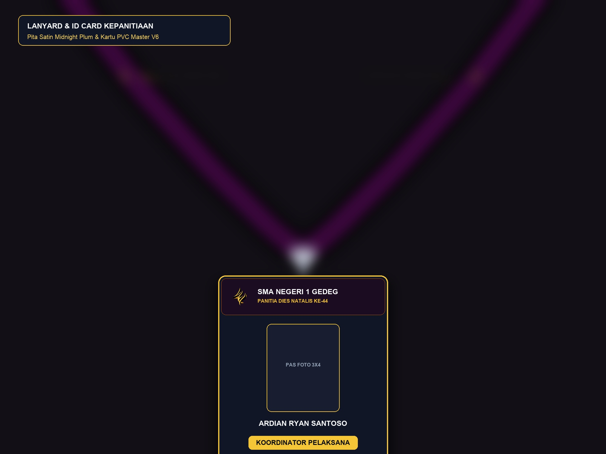

* **Spesifikasi Material Lanyard**:
  - Pita satin polyester kilap halus lebar **20 mm**, panjang **90 cm**, dilengkapi stopper pengaman hitam dan kait putar logam nikel (*metal oval hook*).
* **Teknik Cetak Lanyard**:
  - Cetak sublimasi penuh bolak-balik (*double-sided heat transfer sublimation*) warna dasar *Midnight Plum* (`#360538`) dengan tulisan teks emas "DIES NATALIS 44 • SMAN 1 GEDEG".
* **Spesifikasi ID Card**:
  - Kartu plastik PVC tebal **0,8 mm** (standar ISO CR-80, ukuran $85{,}6 \times 54 \text{ mm}$) dengan laminasi dof (*matte finish*).
  - Bagian atas memuat lambang warna emas V6, foto peserta/panitia, nama lengkap, nomor identitas panitia, serta kode batang keamanan.

---

### 4. Tas Jinjing Kanvas (Tote Bag) & Pin Enamel Sepuh Emas
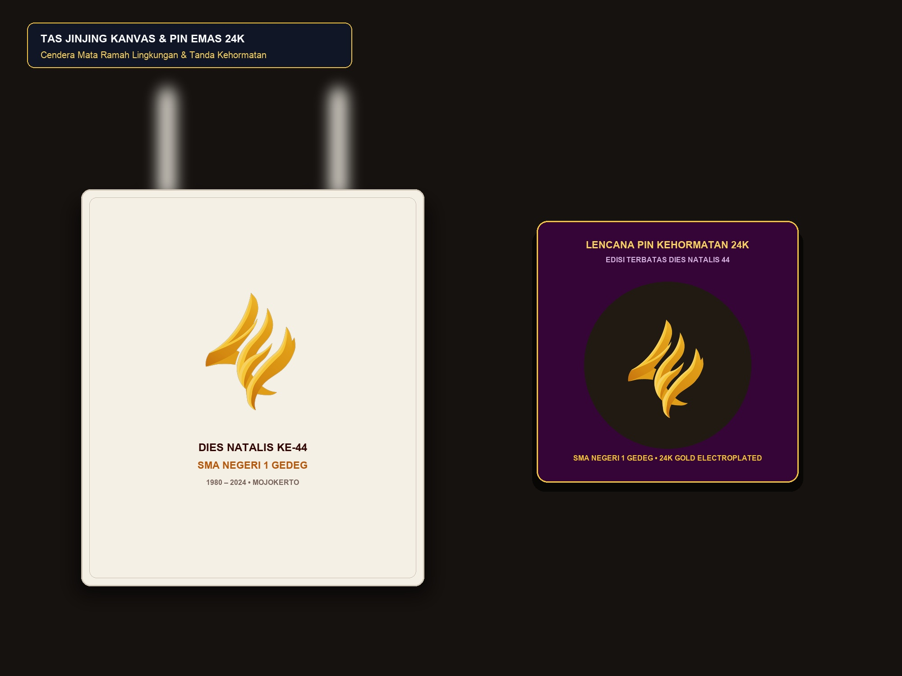

* **Spesifikasi Tas Jinjing (Tote Bag)**:
  - **Material**: Kanvas katun organik tebal 14 oz (*Natural Broken White* atau *Obsidian Black*), dimensi $38 \times 42 \text{ cm}$ dengan tali jinjing 60 cm.
  - **Teknik Cetak**: Sablon pasta plastisol emas berkilau (*Metallic Gold Plastisol Print*) tahan cuci, atau foil emas panas (*hot-stamping gold foil*).
  - **Ukuran Cetak**: Lebar lambang **20 cm** terpusat di bagian depan tas.
* **Spesifikasi Lencana Pin Enamel (Enamel Pin Badge)**:
  - **Material**: Logam *Zinc Alloy Die-Struck* dengan sepuhan emas murni 24 karat (*24K Gold Electroplating*).
  - **Finishing**: Lapisan cat enamel hitam halus dengan kubah resin bening protektif (*Epoxy Dome*).
  - **Dimensi**: Diameter **30 mm**, ketebalan 2,5 mm, dilengkapi klip pengunci kupu-kupu ganda (*double butterfly clutch*).
  - **Peruntukan**: Cendera mata kehormatan untuk dewan guru, tamu VVIP, kepala sekolah purna tugas, dan pengurus inti OSIS.

---

## Logotype Resmi AVERSA (Tema Dies Natalis ke-44)

"**AVERSA**" adalah tajuk utama dan nama tema resmi perayaan Dies Natalis ke-44 SMA Negeri 1 Gedeg. Melambangkan semangat civitas akademika untuk:
1. **Terus berkembang (*continuous growth*)** dalam mengasah keunggulan dan kompetensi diri;
2. **Memiliki visi yang jelas (*clear vision*)** menggapai masa depan berlandaskan budi pekerti luhur;
3. **Membangun solidaritas (*unwavering solidarity*)** yang kokoh antarsiswa, guru, dan alumni;
4. **Berani mewujudkan perubahan melalui tindakan nyata (*courage to act*)** demi kejayaan almamater.

Melalui citra gambar tangan asli ([aversa-handdraw.png](aversa-handdraw.png)), tipografi cair dinamis (*fluid molten gold bubble typography*) ini telah direkonstruksi secara komputasional menggunakan interpolasi kurva Bezier kubik $C^1$ bergradasi palet emas master dengan pantulan kilau cahaya mengilap (*specular highlights*).

### 1. Logotype Vertikal Resmi (Dies Natalis 44 • SMA Negeri 1 Gedeg)
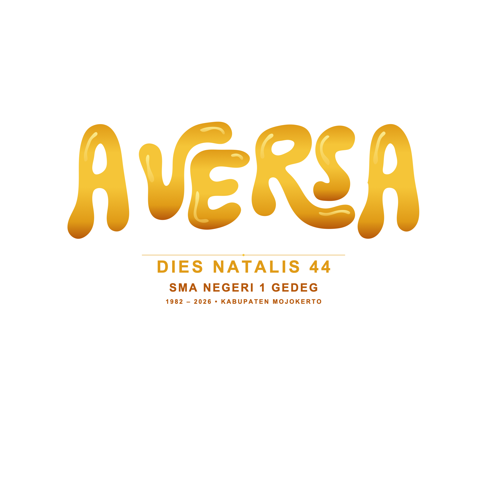

### 2. Logotype Horisontal Resmi
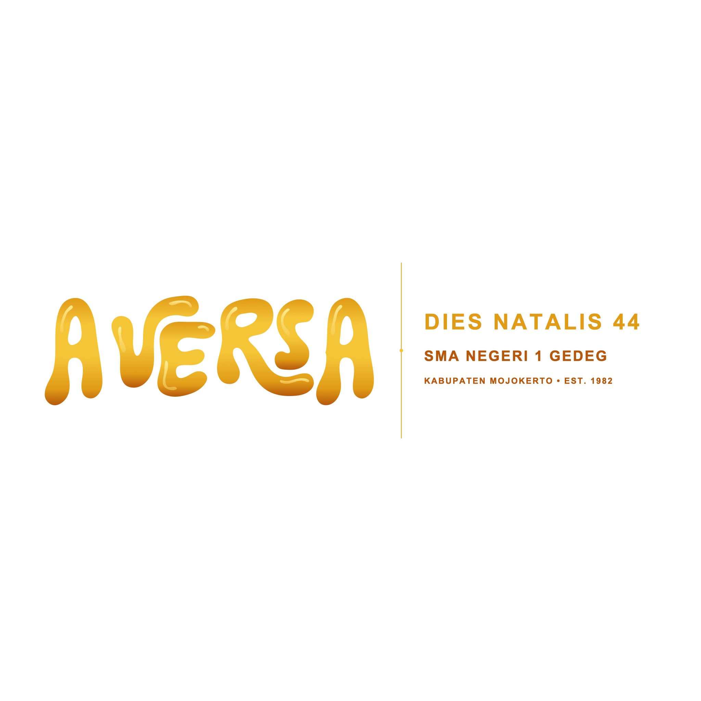

### 3. Full Brand Combination (Simbol Master V6 + AVERSA + Identitas Sekolah)
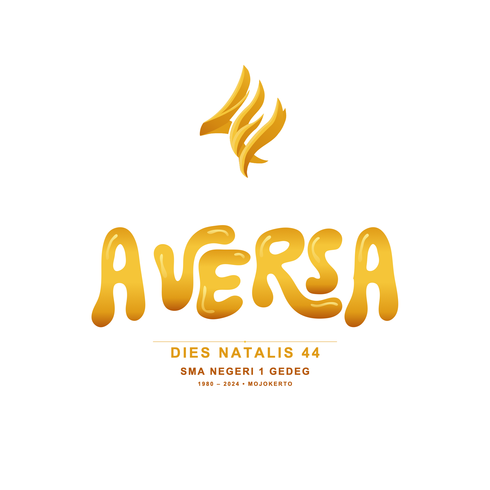

* **Katalog Berkas AVERSA**:
  - `assets/svg/aversa-standalone-color.svg` & `.png`: Tipografi cair AVERSA mandiri.
  - `assets/svg/aversa-standalone-black.svg` & `white.svg`: Varian monokrom untuk cap dinas dan sablon 1 warna.
  - `assets/svg/aversa-logotype-vertical.svg` & `.png`: Susunan vertikal sentral.
  - `assets/svg/aversa-logotype-horizontal.svg` & `.png`: Susunan horizontal banner.
  - `assets/svg/aversa-brand-combination.svg` & `.png`: Integrasi utuh Simbol Rajawali V6 + Wordmark AVERSA.

---

## Metodologi Tracing & Alat Komputasi

Digitalisasi dan kalibrasi lambang dari goresan pensil manual ke vektor matematis V6 dikerjakan secara komputasional (*algorithmic vectorization*) menggunakan ekosistem **Python 3.10+**.

### Perangkat Lunak & Pustaka Komputasi:
* **OpenCV (`cv2`)**: Pengolahan citra raster (penyesuaian kontras adaptif CLAHE, binerisasi ambang batas Otsu, dan ekstraksi batas piksel `cv2.findContours`).
* **NumPy**: Pengolahan matriks titik koordinat $(x, y)$, perhitungan vektor tangen antartitik, dan normalisasi kanvas resolusi $2048 \times 2048$ piksel.
* **SciPy (`scipy.interpolate`)**: Penghalusan titik poligon menjadi kurva Bezier kubik (*cubic Bezier spline fitting*) guna menjamin kontinuitas lengkungan ($C^1$ *continuity*).
* **svgwrite**: Pustaka pembangun struktur XML SVG vektor murni berstandar W3C beresolusi tak terbatas (*infinite vector resolution*).
* **CairoSVG**: Mesin perender untuk menghasilkan berkas raster cetak PNG ultra-tinggi (2048x2048 piksel) dengan transparansi alfa bersih.
* **Matplotlib**: Inspeksi visual kisi-kisi matematis (*geometric construction grid inspection*).

Dokumentasi matematis dan algoritma lengkap dapat dibaca pada [docs/METODOLOGI_TRACING_VEKTOR.md](docs/METODOLOGI_TRACING_VEKTOR.md).

---

## Riwayat Evolusi Perancangan (Sketsa ke V6)

Perancangan identitas visual ini melalui enam tahapan proses kreatif:

| Tahapan | Berkas Masukan / Hasil | Deskripsi Teknis |
| :--- | :--- | :--- |
| **01. Sketsa Pensil Awal** | `raw-draw.jpeg` | Sketsa tangan pensil grafit asli di atas kertas gambar. Berisi proporsi dasar angka kembar 44, arah paruh rajawali, dan lingkaran pandu manual. |
| **02. Lukisan Tangan Digital** | `digital-hand-draw.png` | Pewarnaan tangan digital raster (RGB 24-bit). Menentukan sebaran gradasi api, kontras paruh, dan transisi ketebalan siluet. |
| **03. Vektor Kontur Awal (V1–V2)** | `archive/v1/`, `archive/v2/` | Ekstraksi kontur biner otomatis awal. Masih ditemukan sudut tajam bergerigi pada lengkungan ekor. |
| **04. Blueprint Geometris (V3)** | `archive/v3/` | Penerapan grid busur lingkaran rasio keemasan pada sayap dan kepala rajawali. |
| **05. Kalibrasi Line-Cut & Ekor (V4–V5)**| `archive/v4/`, `archive/v5/` | Penyetaraan celah antar-garis (*kerning gap*) dan perbaikan kelengkungan ujung ekor agar tidak kaku. |
| **06. Master Final V6** | `assets/` & `v6_detailing/` | **Penyempurnaan akhir**: Rekonstruksi total *medial spine* simetris 100%, 4 faset kedalaman 3D, dan standarisasi warna Coolors resmi. |

---

## Sistem Palet Warna Resmi (Master Chromatic Palette)

Palet warna resmi almamater dikalibrasi mengacu pada bagan master `assets/brandkit_elements/png/brand-color-palette-guide.png` dan `assets/svg/brand-color-palette.svg`:

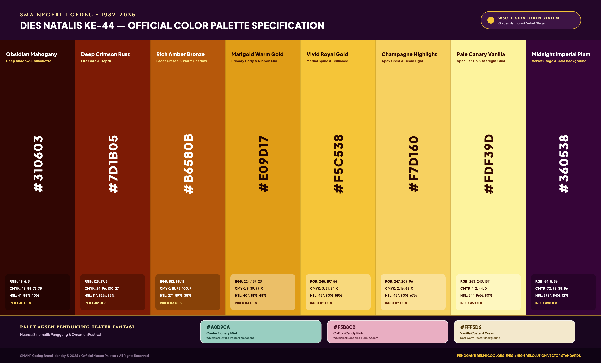

| Nama Warna | Kode Hex | RGB | CMYK | Karakter & Peruntukan |
| :--- | :--- | :--- | :--- | :--- |
| **Obsidian Mahogany** | `#310603` | 49, 6, 3 | 48, 88, 76, 75 | Bayangan terdalam, batas siluet luar lambang, kontras monokrom pekat. |
| **Crimson Fire** | `#7D1B05` | 125, 27, 5 | 24, 96, 100, 27 | Pangkal lidah api berkobar, pembangun dimensi kedalaman. |
| **Bronze Shadow** | `#B6580B` | 182, 88, 11 | 18, 73, 100, 7 | Nada transisi hangat lekukan lipatan faset trimatra. |
| **Marigold Gold** | `#E09B17` | 224, 155, 23 | 9, 39, 99, 0 | Warna inti tubuh lambang dan sayap; memancarkan aura kemuliaan. |
| **Vivid Gold** | `#F5C538` | 245, 197, 56 | 3, 21, 84, 0 | Kilau keemasan medial spine dan aksentuasi garis dinamis utama. |
| **Champagne Gold** | `#F7D160` | 247, 209, 96 | 2, 16, 68, 0 | Sorotan cahaya puncak (*specular highlight*) pada permukaan lambang. |
| **Canary Glow** | `#FDF39D` | 253, 243, 157 | 1, 2, 44, 0 | Pendaran cahaya tertinggi, digunakan untuk gradasi aksen paruh dan api. |
| **Midnight Plum** | `#360538` | 54, 5, 56 | 72, 98, 38, 56 | Latar belakang beludru panggung gala dan cendera mata eksklusif. |

---

## Struktur Repositori & Katalog Aset Master

```text
diesnat44project/
├── raw-draw.jpeg                         # Sketsa pensil asli di atas kertas
├── digital-hand-draw.png                 # Sketsa digital raster berwarna
├── aversa-handdraw.png                   # Sketsa gambar tangan tipografi AVERSA
├── LICENSE                               # Dokumen lisensi kepemilikan tertutup (Proprietary)
├── README.md                             # Ringkasan utama repositori (berkas ini)
│
├── assets/                               # Kumpulan berkas ekspor master siap pakai
│   ├── svg/                              # Berkas vektor SVG resolusi tak terbatas
│   │   ├── logo-symbol-color.svg         # Simbol utama warna penuh (Master V6)
│   │   ├── logo-linecut-black.svg        # Garis kontur presisi (Line-cut)
│   │   ├── logo-horizontal-color.svg     # Susunan horizontal teks SMAN 1 Gedeg
│   │   ├── logo-vertical-color.svg       # Susunan vertikal (Format poster)
│   │   ├── logo-monochrome-black.svg     # Versi monokrom hitam pekat
│   │   ├── logo-monochrome-white.svg     # Versi monokrom putih bersih (Inverted)
│   │   └── logo-with-grid.svg            # Konstruksi kurva & lingkaran rasio emas
│   ├── png/                              # Berkas raster PNG resolusi ultra-tinggi
│   │   ├── logo-symbol-color.png         # Raster 1024x1024 px transparansi alfa
│   │   ├── logo-color-2048.png           # Raster 2048x2048 px resolusi cetak
│   │   └── logo-with-grid.png            # Visualisasi cetak grid konstruksi
│   ├── brandkit_elements/                # Aset Penyerta & Ornamen Brand Kit
│   │   ├── svg/                          # Vektor ornamen (Burst, Ribbons, Swirl, Sparkles)
│   │   ├── png/                          # PNG transparan resolusi tinggi (Canva-ready)
│   │   └── backgrounds/                  # Preset kanvas latar resmi (Feed 1:1 & Story 9:16)
│   ├── anatomy/                          # Diagram anatomi dan gambar fokus bagian logo
│   │   ├── diagram_anatomi_lengkap.png   # Diagram master anatomi lengkap beranotasi
│   │   ├── fokus_01_kepala_tatapan_rajawali.png
│   │   ├── fokus_02_figur_kembar_angka_44.png
│   │   ├── fokus_03_lidah_api_abadi_berkobar.png
│   │   ├── fokus_04_akselerasi_sayap_aerodinamis.png
│   │   └── fokus_05_symmetrical_medial_spine.png
│   └── mockups/                          # Visualisasi produk dan brand identity kit
│       ├── mockup_kaos_polo.jpg          # Mockup kaos polo & t-shirt resmi
│       ├── mockup_tumbler.jpg            # Mockup tumbler stainless steel grafir emas
│       ├── mockup_lanyard_idcard.jpg     # Mockup lanyard satin & kartu panitia
│       └── mockup_totebag_pin.jpg        # Mockup tote bag kanvas & pin enamel emas 24K
│
├── v6_detailing/                         # Kode komputasi vektor master V6
│   └── scripts/
│       ├── generate_v6_master.py         # Skrip Python pembangun seluruh aset SVG V6
│       ├── render_and_verify_v6.py       # Skrip penguji rendering & ekspor PNG
│       ├── generate_anatomy_diagrams.py  # Skrip generator diagram anatomi visual
│       ├── trace_dies_natalis_and_44.py  # Skrip tracing logotype bubble modular
│       ├── generate_supporting_assets.py # Skrip generator ornamen & kanvas dasar
│       ├── build_accurate_brandkit_backgrounds.py # Skrip generator latar mint pinwheel & velvet
│       └── generate_modular_brandkit_items.py # Skrip generator katalog item modular (topi, permen, dll)
│
├── tokens/                               # Spesifikasi token desain resmi
│   ├── design-tokens.json                # Nilai token format JSON W3C
│   └── design-tokens.css                 # Variabel CSS warna & tipografi
│
├── archive/                              # Arsip riwayat pembuatan versi terdahulu
│   ├── v1_initial_trace/                 # Berkas arsip versi 1
│   ├── v2_refined/                       # Berkas arsip versi 2
│   ├── v3_revisi/                        # Berkas arsip versi 3
│   ├── v4_revisi/                        # Berkas arsip versi 4
│   └── v5_revisi/                        # Berkas arsip versi 5
│
└── docs/                                 # Dokumentasi komprehensif
    ├── BRAND_GUIDELINES.md               # Buku pedoman tata cara penggunaan identitas
    ├── METODOLOGI_TRACING_VEKTOR.md      # Metodologi teknis tracing & algoritma kurva
    └── SUPPORTING_ASSETS_GUIDE.md        # Panduan aset penyerta & hirarki warna kanvas
```

---

## Cara Menjalankan Skrip Generator Python

Untuk mereproduksi seluruh berkas SVG, PNG, dan diagram anatomi secara mandiri dari terminal:

```bash
# 1. Pasang pustaka dependensi Python
pip install opencv-python numpy scipy svgwrite cairosvg matplotlib Pillow

# 2. Jalankan skrip pembangun vektor master V6
python3 v6_detailing/scripts/generate_v6_master.py

# 3. Jalankan skrip verifikasi rendering dan ekspor PNG 2048px
python3 v6_detailing/scripts/render_and_verify_v6.py

# 4. Jalankan skrip pembuat diagram anatomi visual
python3 v6_detailing/scripts/generate_anatomy_diagrams.py
```

---

## Tim Kreatif & Atribusi Karya (Creative Credits & Authorship)

> **Dedikasi Khusus**: Karya seni dan sistem identitas visual ini dirancang secara kolaboratif serta dipersembahkan seutuhnya untuk memperingati **Dies Natalis ke-44 SMA Negeri 1 Gedeg, Kabupaten Mojokerto (1982 – 2026)**.

Keberhasilan perancangan identitas visual ini merupakan hasil sinergi artistik lintas disiplin antara seni rupa murni analog (*traditional illustration*), seni lukis digital (*digital painting*), seni tipografi kustom (*hand-lettering typography*), dan rekayasa geometri kurva vektor (*precision vector engineering*):

| Peran Artistik & Spesialisasi | Nama Kreator | Afiliasi / Angkatan | Kontribusi Visual & Deskripsi Karya Seni |
| :--- | :--- | :--- | :--- |
| **Creative Director & Project Initiator** | **Ryan Ardian** | Guru SMAN 1 Gedeg | Penggagas inisiatif proyek, pengarah artistik (*art direction*), orkestrasi perancangan identitas visual terpadu, dan supervisi standar *brand kit*. |
| **Lead Concept Artist & Traditional Sketch Visualizer** | **Putri Nur Azizah** | Angkatan '42 (XII 6) | Kreator sketsa tangan analog asli (*raw graphite concept art*). Merumuskan gestur figuratif elang rajawali, proporsi angka kembar 44, serta anatomi dasar lambang utama di atas kertas grafit. |
| **Custom Lettering Artist & Fluid Typographer** | **Naysila Zahra Alsabella** | Angkatan '43 (XI 1) | Perancang tipografi tangan tema (*hand-drawn theme wordmark*). Menggubah seni tipografi gelembung cair (*liquid molten bubble lettering*) AVERSA yang dinamis, ekspresif, dan ceria. |
| **Digital Colorists & Visual Rendering Artists** | **Culvar Zamiiryaser Setyaji**<br>**Farel Indra Febrihansen** | Angkatan '42 (XI 4)<br>Angkatan '42 (XI 4) | Seniman olah rona & pencahayaan digital (*digital painting & shading*). Mengembangkan translasi warna raster awal, distribusi gradasi api, dan kedalaman dimensional sketsa manual. |
| **Lead Vector Reconstructionist & Precision Geometry Engineer** | **Ryan Ardian** | Guru SMAN 1 Gedeg | Rekonstruksi vektor komputasional matematis ($C^1/C^2$ *cubic Bézier splines*), perbaikan simetri *medial spine*, kurasi palet Coolors resmi, isolasi alpha murni, dan arsitek berkas master SVG/PNG beresolusi tak terbatas. |

---

### Alur Sinergi Penciptaan Karya (*Artistic Creation Continuum*):

1. **Ideasi Tradisional (*Analog Ideation & Concept Sketching*)**:
   Goresan pensil grafit di atas kertas oleh **Putri Nur Azizah** melahirkan proporsi dasar figuratif rajawali dan angka 44, sementara **Naysila Zahra Alsabella** mengeksplorasi tipografi organik AVERSA dengan aliran bentuk cair (*fluid morphology*).
2. **Pewarnaan & Pencahayaan Digital (*Digital Painting & Illumination*)**:
   **Culvar Zamiiryaser Setyaji** bersama **Farel Indra Febrihansen** menerjemahkan garis sketsa manual menjadi lukisan digital raster penuh rona, menyuntikkan atmosfer visual hangat dan sebaran gradasi lidah api keemasan.
3. **Rekonstruksi Geometris Vektor (*Computational Vector Mastery*)**:
   **Ryan Ardian** merekonstruksi citra raster menjadi kurva vektor kontinu berstandar industri grafis internasional, menyempurnakan simetri faset trimatra, mengeliminasi distorsi, serta membakukan seluruh berkas master SVG dan PNG siap produksi.

---

## Hak Cipta & Lisensi Kepemilikan

Seluruh karya cipta grafis, lambang, skrip komputasi, dan dokumentasi di dalam repositori ini dilindungi oleh undang-undang hak cipta Republik Indonesia.

Status lisensi adalah **PROPRIETARY / ALL RIGHTS RESERVED (LISENSI TERTUTUP MUTLAK)** milik:
* **SMA Negeri 1 Gedeg, Kabupaten Mojokerto**
* **Ardian Ryan**

Dilarang keras menyalin, memodifikasi, mendistribusikan, mempublikasikan ulang, atau menggunakan materi ini untuk kepentingan pihak ketiga tanpa izin tertulis resmi dari pemegang hak cipta. Teks hukum lengkap tercantum pada berkas [LICENSE](LICENSE).
